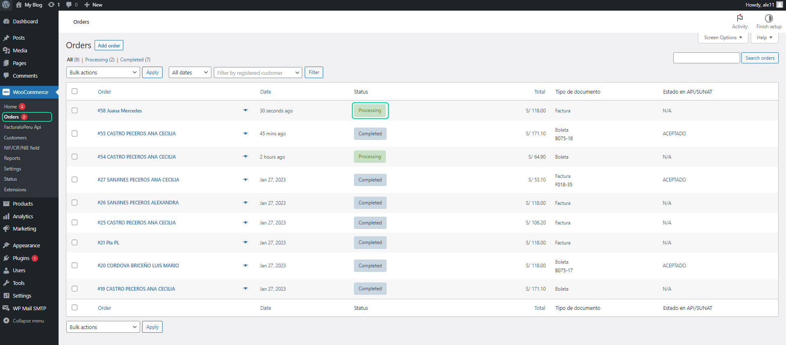
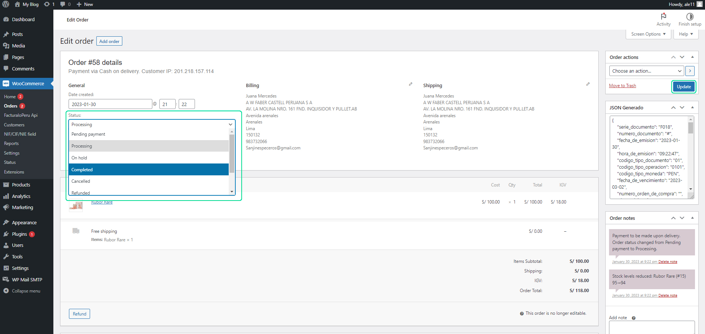
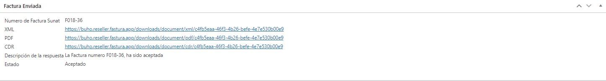
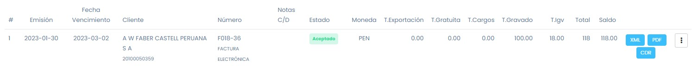
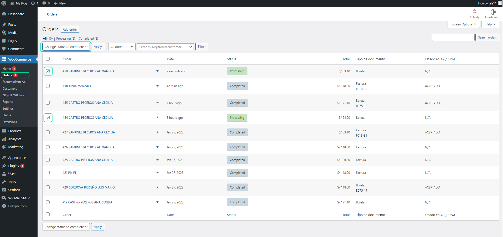
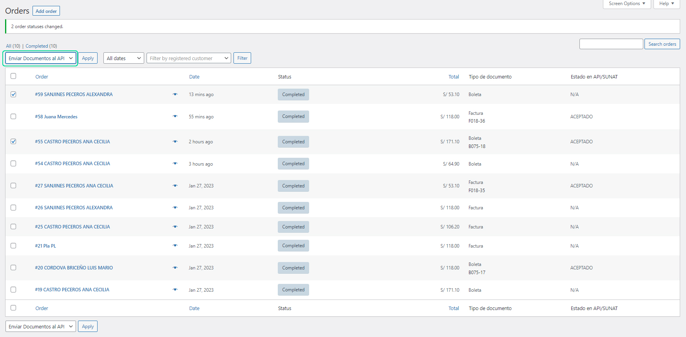
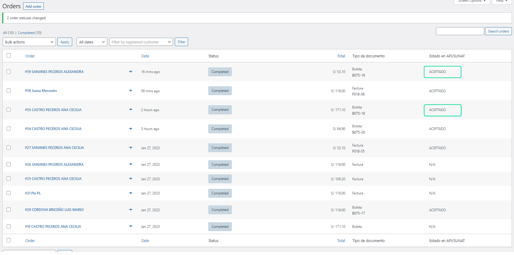

# Completar pedido

En este artículo te enseñaremos a como completar el pedido. Sigue estos pasos para realizarlo:

## Flujo individual

Ingresa a la categoría **Pedidos**, se observara el pedido en el panel de administración, se observara el estado del pedido.

Selecciona el pedido para cambiar el estado:

Seleccionando el estado de En proceso a Completado, seguido selecciona el botón Actualizar.

Al cambiar el estado a Completado, se generará un json y será enviado a la API, obteniendo y guardando la información de respuesta:

Podrá comprobar el documento en su Facturador o API.

## Flujo Masivo

Si tiene varias ventas sin enviar, puede seleccionarlas en las casillas de selección y seguido cambiar el estado a completado y selecciona el botón Aplicar.

Luego de cambiar el estado a aceptado, usa la opción masiva de envío al APIy selecciona el botón Aceptar.

Si el envío es correcto se mostrarán automaticámente los datos del API

