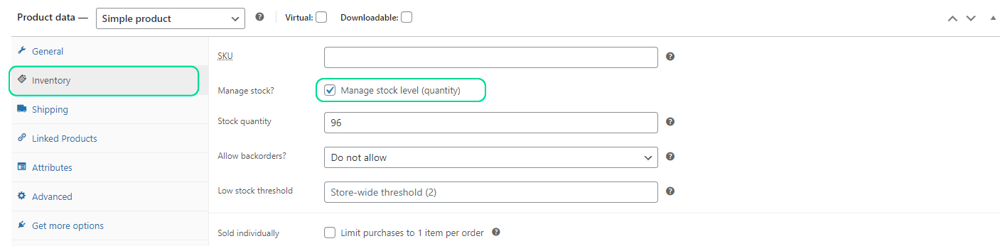
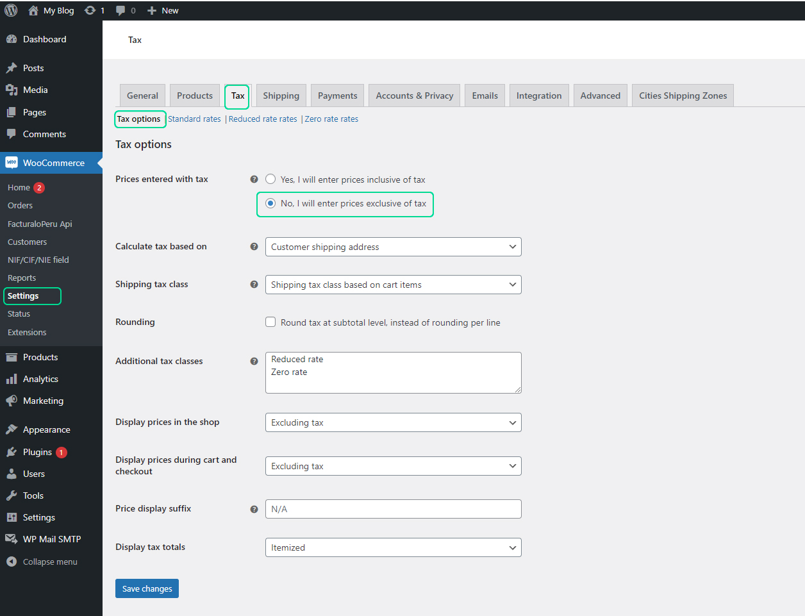
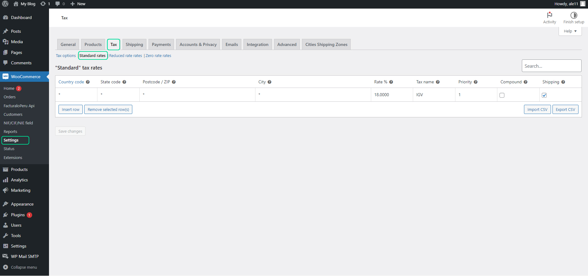
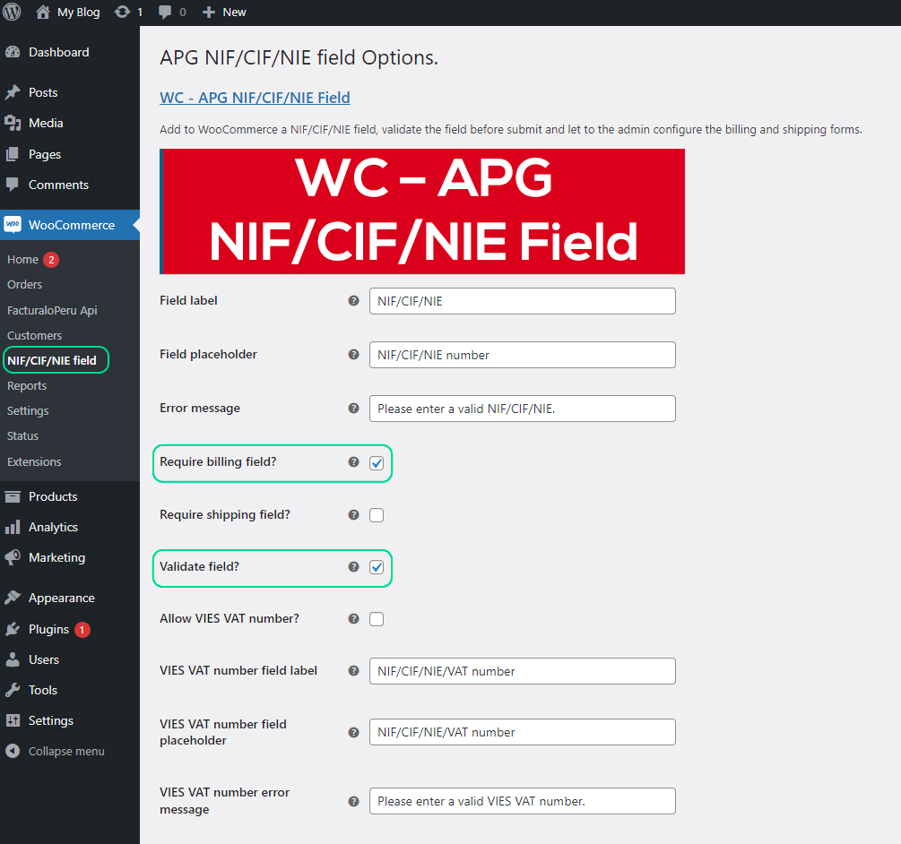
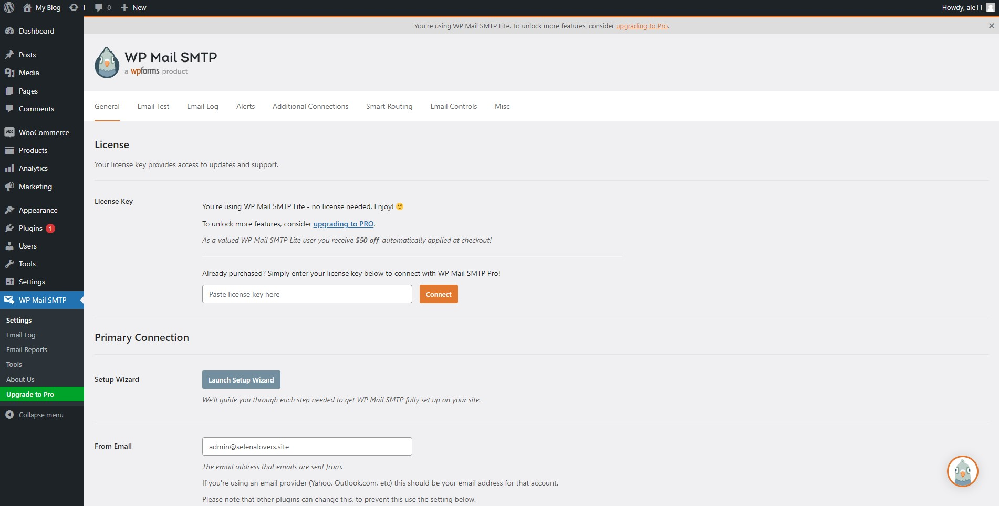
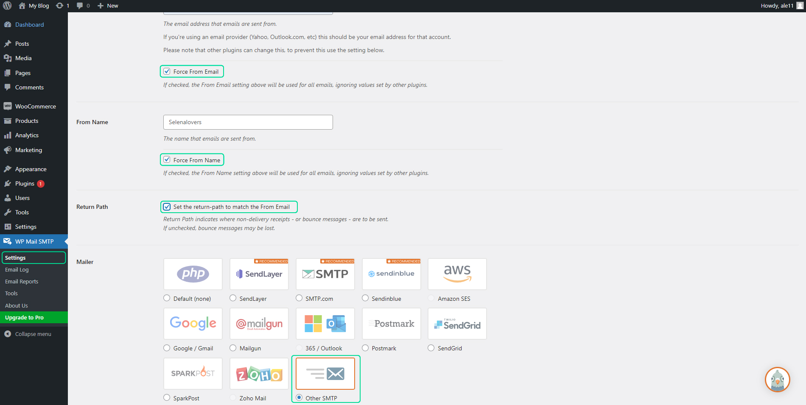
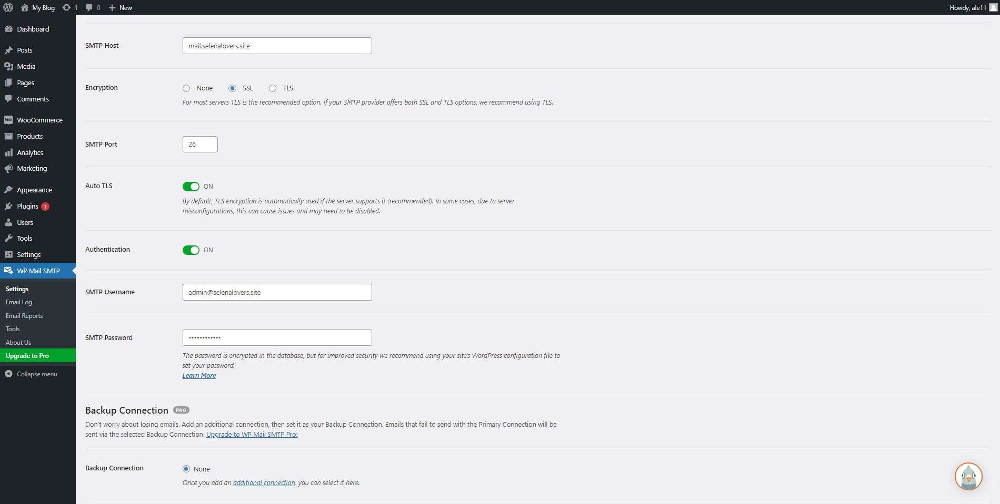
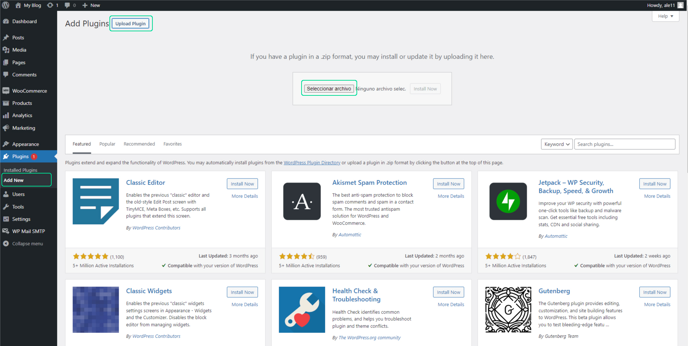

# Pluggin Api

En este artículo te enseñaremos a descargar el pluggin para activarlo en tu wordpress. Sigue estos pasos para realizarlo:

Descarga los siguientes pluggins:

- WooCommerce
- WC - APG NIF/CIF/NIE Field
- WP Mail SMTP (opcional)
- FacturaloPeru
- Ubigeo-peru

:::info IMPORTANTE:

Tener una instalación limpia de Wordpress superior a la versión 5.0.1

:::

## Configuración Plugin WooCommerce

Siga los pasos de este **[vídeo](https://www.youtube.com/watch?v=Q1-sTSSdrMY)**.

## Agregar Productos

Para agregar productos, relacionados con el sistema de facturación, sigue todos los pasos en este **[artículo](https://buho.la/ayuda/servicios/fastura-reseller/api-rest-documentacion/agregar-productos-conectados-a-mi-sistema-de-facturacion)**.

## Manejar Inventario de los Productos

Activar el inventario por producto.

Al realizar compras añadiendo productos al carrito de compras solo permitirá el monto máximo o de manera individual si así ha marcado en la casilla “Vendido individualmente”, al agotarse la existencia el producto se seguirá mostrando en la tienda pero sin posibilidad de añadirlo al carrito, si el producto es cancelado en algun pedido, este se devuelve al inventario automáticamente. Una breve explicación en el siguiente video:

**[https://www.youtube.com/watch?v=j1nWw7b6lF4](https://www.youtube.com/watch?v=j1nWw7b6lF4)**

### Impuesto:

Para agregar impuestos para el producto, selecciona la siguiente casilla de selección:

Seguido seleccionar la siguiente opción:

Para configurar el porcentaje del IGV, complete los siguientes campos como en la imagen:

## Plugin WC - APG NIF/CIF/NIE Field

Este plugin agrega el campo destinado para RUC/DNI correspondiente del cliente, tanto en el formulario de compra como en el detalle de pedido, además lo añade al envío hacia la API.

Selecciona las siguientes casillas de selección:

:::info IMPORTANTE

Con el plugin Facturaloperu-wp-api-invoice este campo del formulario al ser llenado con un DNI/RUC válido es capaz de autocompletar el resto de los campos.

:::

## Plugin WP Mail SMTP

Este plugin se ha instalado para el envío de correos en cada paso que se realiza en el woocommerce, además también habilita que cualquier correo que salga de wordpress utilice el que se agregue a la configuración.

**Configuración:** Para las pruebas se ha utilizado Gmail en la opción Other SMTP.

Activar las siguientes casillas de selección:

Completo los siguientes datos con información de su correo:

## Plugin Facturalo 2.0

Descargar el plugin desde el siguiente link:
**[https://conejo.buho.host/facturador.zip](https://conejo.buho.host/facturador.zip)**

Se descargara el plugin como archivo comprimido.

Desde el panel de administración de Wordpress, ir al menú Plugins -> Añadir nuevo. Pulsar sobre el botón superior "Subir plugin", en la siguiente pantalla aparecerá un botón para seleccionar archivo, cargar el plugin. Seguido el botón **Instalar ahora**.

Activa el plugin, seleccionando el botón **Activar Plugin**.

Configuración previa para conectar el API con el sistema de facturación: Es importante configurar los 4 parámetros principales para el envío de boletas y facturas, de lo contrario generará errores al momento de ejecución.

Ingresa los siguientes datos:

1. **API_TOKEN:** Ingresa el api-token que se encuentra en tu sistema de facturación, en el módulo **Usuarios/Locales & Series**, en la subcategoría **Usuarios**.

2. **API_URL:** Ingresa la URL de tu sistema de facturación.

:::info IMPORTANTE

La URL debe contener http o https, el subdominio del cliente en el facturador y finalizar en /api/ para su correcto funcionamiento.

:::

3. **FACTURA:** Ingresa la serie de tu factura.

4. **BOLETA:** Ingresa la serie de tu factura.

Seguido selecciona el botón de **Guardar cambios**.

## Ubigeo-peru

Descargar el plugin desde el siguiente link: **[https://conejo.buho.host/ubigeo.zip](https://conejo.buho.host/ubigeo.zip)**

Se descargara el plugin como archivo comprimido.

Desde el panel de administración de Wordpress, ir al menú Plugins -> Añadir nuevo. Pulsar sobre el botón superior "Subir plugin", en la siguiente pantalla aparecerá un botón para seleccionar archivo, cargar el plugin. Seguido el botón Instalar ahora.

Activa el plugin, seleccionando el botón **Activar Plugin**.

Para completar el pedido, siga los pasos del siguiente **[artículo](https://fastura.github.io/admin/API-rest-documentaci%C3%B3n/Completar-pedido)**.
