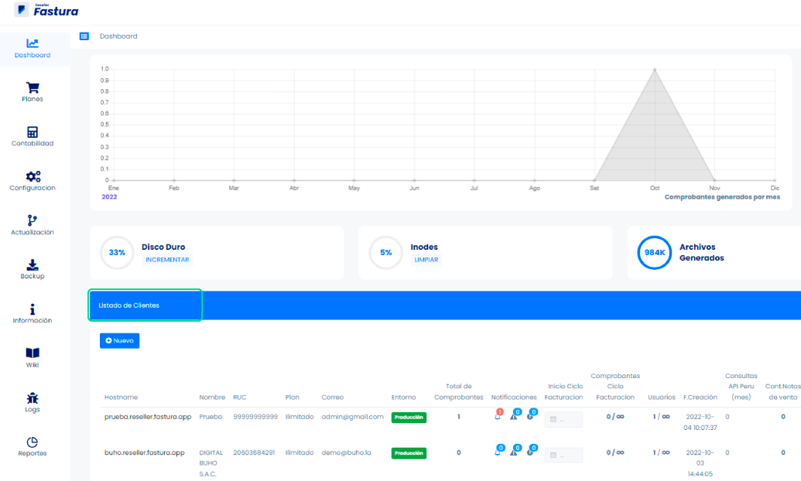
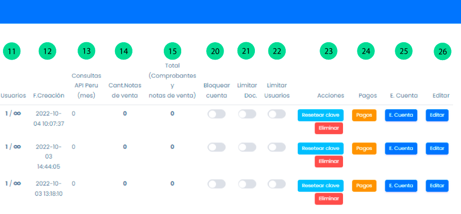
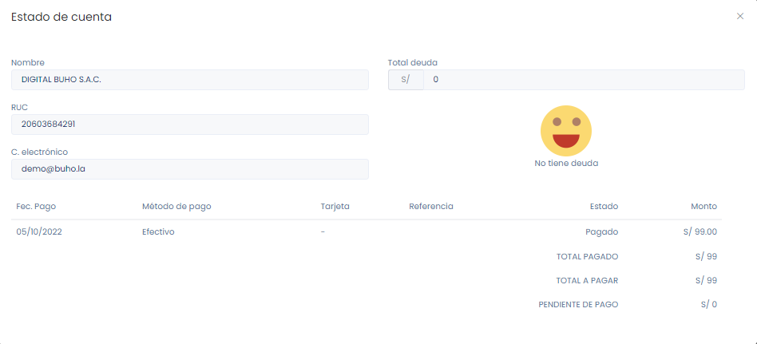

# Dashboard

Ingresar al **Dashboard**, ubicar en **Listado de clientes** y veremos los siguientes datos del cliente y configuraciones.

## Secciones detalladas

1. Hostname: Nombre del link de acceso para la empresa.
2. Nombre: Razón social de la empresa.
3. RUC: Número de contribuyente.
4. Plan: El plan afiliado que escogió el cliente.
5. Correo: El correo del cliente.
6. Entornos: DEMO (entorno prueba) o PRODUCCIÓN (entorno funcional).
7. Total de Comprobantes: Total de Comprobantes desde el inicio del sistema.
8. Notificaciones: alerta de comprobantes no enviados, pendientes de anulación y con algún error para enviar.
9. Inicio Ciclo Facturación: Puedes elegir el inicio de tu ciclo de facturación.
10. Comprobantes Ciclo de Facturación: Número de comprobantes al mes.

11. **Usuarios:** Número de usuarios creados/número de usuarios permitidos.
12. **Fecha Creación:** Día y hora exacta de la fecha de creación.
13. **Consultas API Perú (mes):** Número de consultas (RUC y DNI) realizadas por el API.
14. **Cant. Notas de venta:** Total mensual de documentos internos.
15. **Total (Comprobantes y notas de venta):** El total mensual del punto 7 y 14.
16. **Bloquear cuenta:** Puedes bloquear el sistema del cliente.
17. **Limitar Doc.:** Limitar Documentos, si el plan asignado al cliente tiene un límite de documentos, este será aplicado si la opción está activa. De desactivarse la opción esta cuenta podrá emitir documentos ilimitadamente.
18. **Limitar Usuarios:** Si el plan asignado al cliente tiene un límite de usuarios, este será aplicado si la opción está activa. De desactivarse la opción esta cuenta podrá crear usuarios ilimitadamente.
19. **Acciones: Resetear clave:** se resetea la clave que eligió y se actualiza con el número de RUC.

20. **Pagos**: Puedes hacer la programación de pagos del cliente eligiendo la fecha, el método de pago, el monto.

    1. **Fecha de pago:** Seleccionar el día de pago.
    2. **Método de pago:** Seleccionar el método de pago de preferencia.

    3. **Tarjeta:** Si seleccionó tarjeta en el método de pago aparecerá la opción caso contrario no aparecerá.
    4. **Referencia:** Es un dato personal para que el sistema identifique los pagos realizados.
    5. **Monto:** Ingrese el monto de la deuda.
    6. **Pagar:** Hay dos botones, uno que es un check para confirmar la deuda y el otro que es un aspa que cancela la deuda.

21. **E.Cuentas:** Estado de cuenta, puedes visualizar si el cliente tiene algún pago pendiente.

22. **Editar:** Se puede editar el plan,módulos,entorno de sistema y configuración del correo pero no los datos del cliente.

